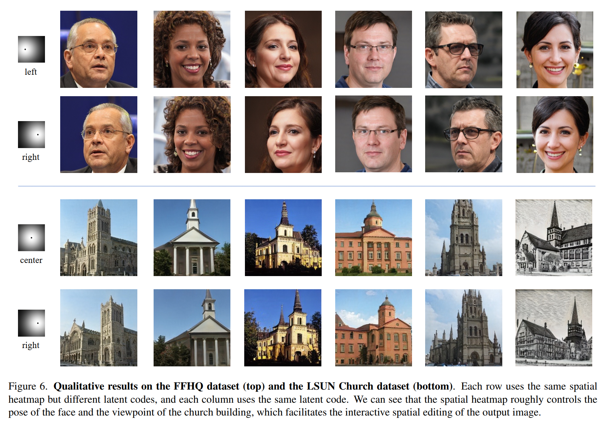

# EqGAN - Improving GAN Equilibrium by Raising Spatial Awareness


> **Improving GAN Equilibrium by Raising Spatial Awareness** <br>
> Jianyuan Wang, Ceyuan Yang, Yinghao Xu, Yujun Shen, Hongdong Li, Bolei Zhou <br>
> *arXiv preprint*


[[Paper]()]
[[Project Page](https://genforce.github.io/eqgan/)]
[[Demo](https://www.youtube.com/watch?v=k7sG4XY5rIc)]

<!-- [[Project Page](https://genforce.github.io/eqgan/)] -->
<!-- [[Project Page](https://github.com/jytime/eqgan/blob/main/docs/index.html)] -->


In Generative Adversarial Networks (GANs), a generator (G) and a discriminator (D) are expected to reach a certain equilibrium where D cannot distinguish the generated images from the real ones. However, in practice it is difficult to achieve such an equilibrium in GAN training, instead, D almost always surpasses G. We attribute this phenomenon to the information asymmetry that D learns its own visual attention when determining whether an image is real or fake, but G has no explicit clue on which regions to focus on. 

To alleviate the issue of D dominating the competition in GANs, we aim to raise the spatial awareness of G. We encode randomly sampled multi-level heatmaps into the intermediate layers of G as an inductive bias. We further propose to align the spatial awareness of G with the attention map induced from D. Through this way we effectively lessen the information gap between D and G. Extensive results show that our method pushes the two-player game in GANs closer to the equilibrium, leading to a better synthesis performance. As a byproduct, the introduced spatial awareness facilitates interactive editing over the output synthesis.  </div>


<!-- 
## Qualitative results

### LSUN Cat ###


### FFHQ and LSUN Church ###


 -->


## BibTeX

```bibtex
@article{wang2021eqgan,
  title   = {Improving GAN Equilibrium by Raising Spatial Awareness},
  author  = {Wang, Jianyuan and Yang, Ceyuan and Xu, Yinghao and Shen, Yujun and Li, Hongdong and Zhou, Bolei},
  article = {arXiv preprint},
  year    = {2021}
}
```
